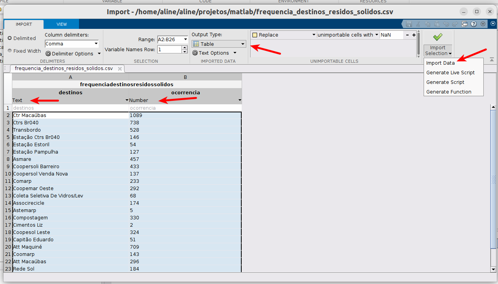
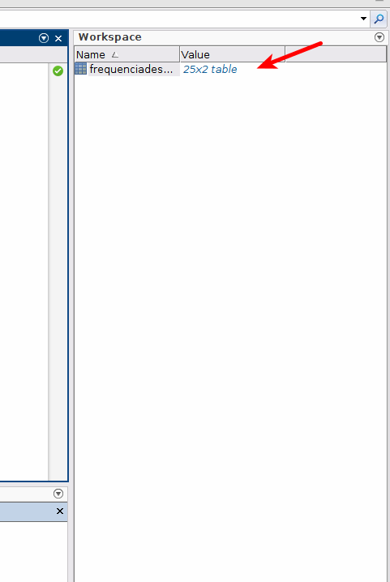

# Matlab: Importando dados

Frequentemente, utilizamos o MATLAB para realizar análise de dados, 
por exemplo, dados de experimentos e de pesquisas em campo. 
Para utilizar esses dados, precisamos importá-los. 

## Importando dados via código

Existem diversos recursos que permitem importar dados no MATLAB, como por exemplo,
a função [readtable](https://www.mathworks.com/help/matlab/ref/readtable.html). 
Para utilizá-la, basta informar o nome do arquivo que desejamos importar. Por exemplo:

```matlab
filename = 'frequencia_destinos_residos_solidos.csv';
dataset = readtable(filename);
```

No exemplo acima, estamos importando a frequência de uso dos [destinos de resíduos sólidos](dataset/frequencia_destinos_residos_solidos.csv) utilizados pela [Prefeitura de BH](https://dados.gov.br/dataset/destinacao-de-residuos-solidos).

Para acessar os dados da coluna `ocorrencia`, podemos utilizar:

```matlab
dataset.ocorrencia;
```

## Importando dados via assistente de importação

Podemos importar os dados manualmente, utilizando o assistente de importação do MATLAB, conforme mostrado na figura a seguir. Para tanto, basta acessar o menu `Home > Import Data`. Em seguida, selecionar o arquivo que você deseja importar.


Uma tela será exibida, onde podemos realizar algumas configurações, como por exemplo, informar o tipo dos dados, conforme mostrado na figura a seguir.


Após realizar as configurações, basta importar o arquivo através da opção `Import data`, conforme mostrado na figura abaixo.



Os dados importados são exibidos no `Workspace`, conforme mostrado na figura a seguir. Para renomear o aquivo, basta pressioná-lo com o botão direito do mouse e selecionar a opção "Rename".




