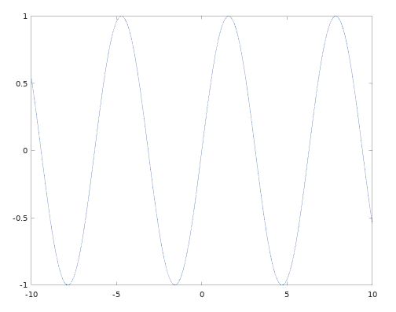
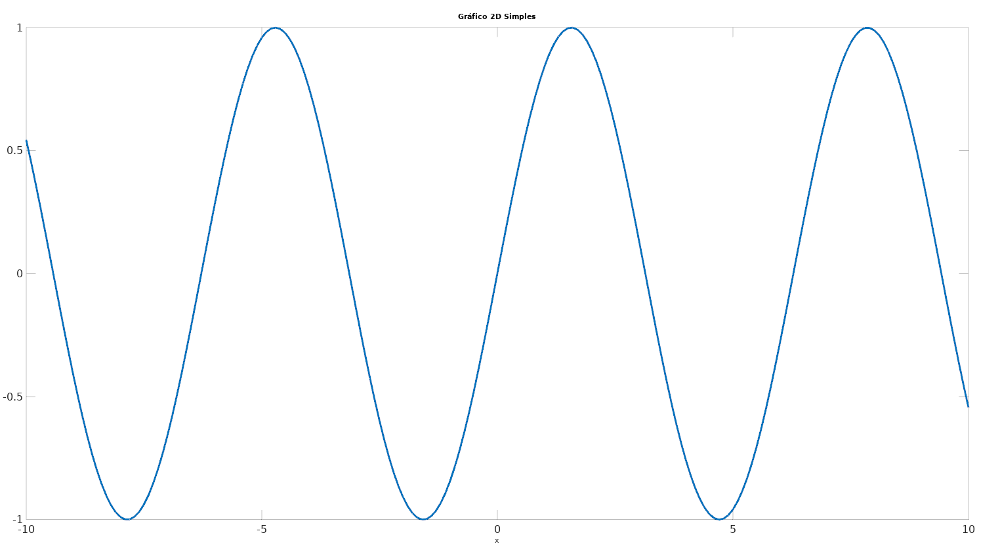
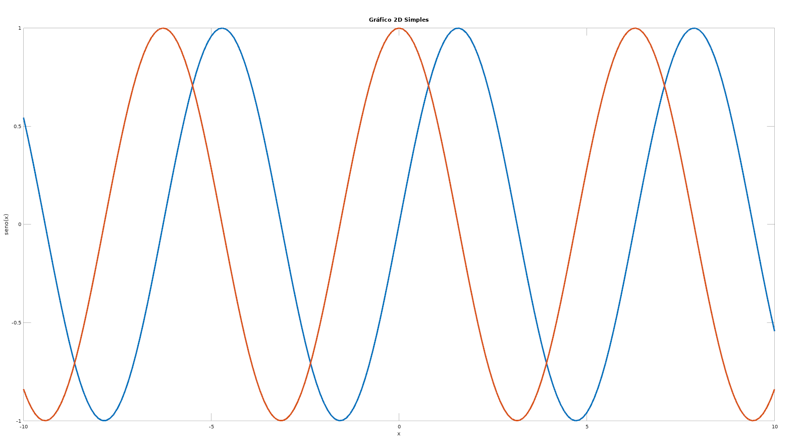
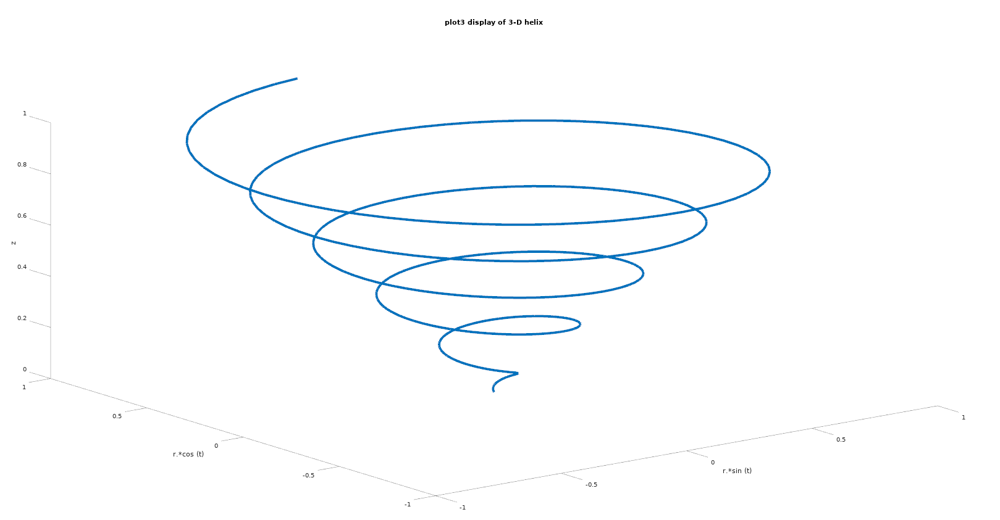

# Matlab/Octave: Gráficos

## Gráficos de Duas Dimensões (2D) e Função Plot

Através da função de [`plot`](https://octave.org/doc/v6.4.0/Two_002dDimensional-Plots.html) podemos criar gráficos x-y simples com eixos lineares. Por exemplo:

```matlab 
x = -10:0.1:10;
y = sin(x)
plot (x, y);
```
Os comandos acima geram o gráfico de uma senoide, conforme a imagem abaixo. 



A variável X recebe um vetor com números de -10 até 10, variando 0.1, isto é:

```matlab 
x = [-10.000    -9.900    -9.800    -9.700    -9.600    -9.500 ...]. 
```

A função `sin` calcula o seno para cada elemento do vetor, isto é:

```matlab 
y = [0.54402   0.45754   0.36648   0.27176   0.17433 ...]
```

Podemos customizar os gráficos utilizando funções auxiliares. Por exemplo, podemos adicionar título e nomes dos eixos utilizando as funções  `xlabel`, `ylabel`, `title`. Exemplo:

```matlab 
x = -10:0.1:10;
y = sin(x)
plot (x, y);
xlabel ("x");
ylabel ("seno(x)");
title ("Gráfico 2D Simples");
```


Existem também [recursos auxiliares](https://octave.org/doc/v6.4.0/Line-Properties.html) para customizar as fontes, cores, e formatos das linhas. Por exemplo, por padrão, a largura das linhas desenhadas é `0.3`. Na Figura abaixo, aumentados a largura da linha para `3` com o parâmtro `linewidth` )

```matlab 
x = -10:0.1:10;
plot (x, sin(x), "linewidth", 3);
xlabel ("x");
ylabel ("seno(x)");
title ("Gráfico 2D Simples");
```




Podemos também, desenhar várias linhas no mesmo gráfico. Por exemplo:

```matlab 
clf;
clear;clc;

x1 = -10:0.1:10;
y1 = sin(x1)

x2 = -10:0.1:10;
y2 = cos(x2)

plot (x1, y1, "linewidth", 3, x2, y2, "linewidth", 3);
xlabel ("x");
ylabel ("seno(x) e cos(x)");
title ("Gráfico 2D Simples");
```




## Gráficos de Três Dimensões (3D)

O Octave/Matlab também provê recursos para geração de [gráfcicos 3D](https://octave.org/doc/v6.4.0/Three_002dDimensional-Plots.html#Three_002dDimensional-Plots). Por exemplo, a função `plot3` exibe dados tridimensionais arbitrários:

```matlab
clf;
clear;clc;

t = 0:0.1:10*pi;
r = linspace(0, 1, numel(t));
z = linspace(0, 1, numel(t));
plot3 (r.*sin(t), r.*cos(t), z, "linewidth", 4);
xlabel ("r.*sin(t)");
ylabel ("r.*cos(t)");
zlabel ("z");
title ("Exemplo de gráfico usando plot3");

```

Os comandos acima definem uma linha em formato espiral:





## Comandos úteis:

* `clf`: Para apagar o gráfico desenhado na janela aberta sem fechá-la.

